<p align="center">
  
</p>

<div align="center">

# ClauFlow

**Drag a task. The agent ships the PR.**

An open-source agentic kanban board.<br/>
Move a card to **DOING** — Claude Code branches, writes, commits, and opens a pull request. Comment in **REVIEW** — Claude re-runs against the same branch.

[](#stack)
[](https://docs.claude.com/en/docs/claude-code/overview)
[](#license)

[Roadmap](ROADMAP.md) · [Architecture](CLAUDE.md) · [Issues](https://github.com/furkaanasik/ClauFlow/issues)

</div>

---

## What is ClauFlow?

ClauFlow turns a kanban board into an autonomous development pipeline. Instead of writing code yourself, you describe the work as a task — moving the card across columns drives a real engineering workflow behind the scenes.

- **TODO → DOING** spawns the Claude Code CLI in a fresh feature branch, lets it implement the change, then commits, pushes, and opens a pull request.
- **REVIEW** is where humans take over — read the diff in the built-in side-by-side viewer, leave comments, and Claude re-runs against the same branch to apply the requested changes.
- **DONE** auto-merges the PR via `gh pr merge`.

Every step streams over WebSocket, so the agent's logs, status transitions, and PR updates appear live in the UI.

```
TODO  →  DOING  →  REVIEW  →  DONE
          ↑           ↑           ↑
       agent       human       gh pr merge
```

## Why "ClauFlow"?

ClauFlow — **Clau**de + work**Flow**.

Most "agentic" tools today are chat boxes with extra steps. You paste a prompt, watch a wall of text scroll by, copy back the diff. The agent's work doesn't fit anywhere — not in your tracker, not in your git history, not in your team's process.

ClauFlow takes the opposite bet: agents belong **inside** the workflow you already use. A kanban card is a unit of work. A pull request is a unit of review. The agent's job is to bridge the two — and your job is to drag, comment, and merge.

There's no chat. There's no copy-paste. The board is the interface, the PR is the contract, and the agent is the one in between.

## Features

- **Drag-driven AI execution** — column transitions trigger real git/Claude/gh pipelines, no manual scripts
- **Branch-aware comment loop** — review feedback gets applied as new commits on the same PR branch
- **Live agent logs** — WebSocket stream of every step: checkout, prompt, commit, push, PR
- **Built-in PR viewer** — full-screen drawer with side-by-side diff, file tree, per-file collapse, Mark viewed
- **Multi-project support** — sidebar with search; each project has its own board, repo, and tasks
- **GitHub via `gh` device flow** — no custom OAuth app to register
- **i18n + theming** — TR/EN toggle and dark/light mode, both persisted in `localStorage`
- **SQLite (WAL mode)** — transaction-safe storage, automatic migration from the legacy `tasks.json`

---

## Quick Start

### Prerequisites

ClauFlow shells out to two CLIs at runtime — both must be installed and authenticated **before** you start the backend:

| CLI | Why it's needed | Install | Auth |
|-----|-----------------|---------|------|
| **Claude Code** (`claude`) | Runs the actual code generation in each executor / comment task | [docs.claude.com/claude-code](https://docs.claude.com/en/docs/claude-code/overview) | `claude` (first run prompts login) |
| **GitHub CLI** (`gh`) | Clones repos, sets up git credentials, opens & merges PRs | macOS: `brew install gh` · Arch/CachyOS: `sudo pacman -S github-cli` · Debian/Ubuntu: see [cli.github.com](https://cli.github.com) | `gh auth login` then `gh auth setup-git` |

Plus **Node.js 18+**, **pnpm**, and **Git** with a configured identity.

```bash
claude --version
gh auth status
node --version
```

### Install & Run

```bash
# Backend (port 3001)
cd core && npm install && npm run dev

# Frontend (port 3000)
cd gui && pnpm install && pnpm dev
```

### Environment

Create `gui/.env.local`:

```env
NEXT_PUBLIC_API_BASE=http://localhost:3001
NEXT_PUBLIC_WS_URL=ws://localhost:3001
```

Open <http://localhost:3000>, connect a GitHub repo, drop a card on **DOING**, and watch the agent work.

---

## How It Works

### Task execution

1. User drags a task from **TODO → DOING**
2. Backend fires the executor (non-blocking)
3. Executor checks out the base branch, creates `feature/issue-<id>`, runs `claude -p "<task analysis>"`, commits, pushes, opens a PR via `gh pr create`
4. Every step broadcasts over WebSocket → live log in the UI
5. No remote → task goes straight to **DONE**. Remote exists → task moves to **REVIEW**

### Comment runner

1. User adds a comment on a task in **REVIEW**
2. Backend saves the comment, fires the comment runner
3. Runner checks out the task's existing branch, runs Claude with the comment as feedback, commits and pushes (no new PR opened)
4. Comment status updates live: spinner → ✓ done / ✗ error

### Agent team (for the project's own development)

| Agent    | Role |
|----------|------|
| planner  | Breaks requests into tasks |
| frontend | Next.js / React / UI changes |
| executor | Git, Claude CLI orchestration |
| reviewer | PR review, merge |

The team only spawns for non-trivial work — see [`CLAUDE.md`](CLAUDE.md) for the rules.

---

## Architecture

```
┌──────────────┐   HTTP+WS   ┌──────────────┐   spawn   ┌──────────────┐
│  Next.js 15  │ ──────────▶ │  Express +   │ ────────▶ │ claude CLI   │
│  (gui, 3000) │ ◀────────── │  WebSocket   │           │ git / gh CLI │
└──────────────┘             │  (core,3001) │           └──────────────┘
                             └──────┬───────┘
                                    │ better-sqlite3 (WAL)
                                    ▼
                             ┌──────────────┐
                             │   tasks.db   │
                             └──────────────┘
```

| Layer    | Stack |
|----------|------|
| Frontend | Next.js 15 (App Router), Tailwind CSS 4, Zustand, dnd-kit |
| Backend  | Node.js, Express, `ws`, `better-sqlite3` (WAL mode) |
| AI       | Claude Code CLI (`claude`) |
| VCS      | Git + GitHub CLI (`gh`) |

Two packages, run independently:

- [`core/`](core/) — Express + WebSocket backend (Node.js, `npm`, port `3001`). SQLite store, executor / comment-runner pipelines, REST + WS routes.
- [`gui/`](gui/) — Next.js 15 frontend (`pnpm`, port `3000`). Kanban board, PR viewer, project sidebar.

For the deeper tour — data flow, WS event shape, conventions — see [`CLAUDE.md`](CLAUDE.md).

---

## Scripts

```bash
# Backend
npm run dev        # tsx watch
npm run build      # tsc
npm run typecheck  # tsc --noEmit

# Frontend
pnpm dev           # next dev
pnpm build         # next build
pnpm typecheck     # tsc --noEmit
pnpm lint          # eslint
```

---

## Contributing

PRs welcome. A few notes before you open one:

- **Read [`CLAUDE.md`](CLAUDE.md) first** — it documents the data flow, WS event shape, and project conventions (no `window.confirm`, Tailwind v4 theming, comment runner contract).
- **Roadmap** lives in [`ROADMAP.md`](ROADMAP.md). Pick something marked active or open an issue before tackling a larger change.
- Run `npm run typecheck` (in `core/`) and `pnpm typecheck && pnpm lint` (in `gui/`) before pushing.
- Keep commits scoped, PR descriptions focused on the *why*.
- ClauFlow is a kanban for Claude — feel free to use it on its own repo. Meta loops are encouraged.

---

## License

MIT
